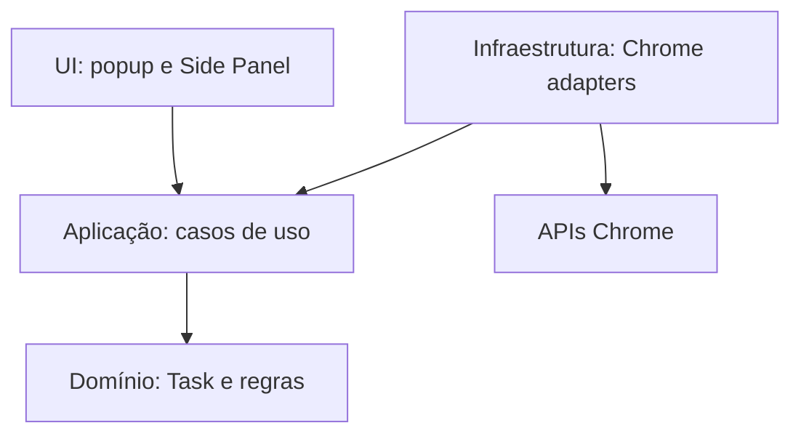

# Arquitetura do TaskFlow

## Contexto

O TaskFlow é uma extensão pessoal, autocontida e local-first para Chrome. O núcleo deve funcionar sem conta, backend próprio, autenticação central ou serviço operado pelo projeto. Popup, Side Panel, service worker e persistência local formam o produto executável.

## Decisões

### Sempre autocontido

O TaskFlow não terá backend próprio ou obrigatório. Dados de tarefas, configurações e regras permanecerão na extensão. Evoluções de persistência devem priorizar mecanismos locais, exportação/importação e adapters substituíveis sem tornar o funcionamento principal dependente de rede.

Integrações externas poderão existir somente como recursos opcionais e explícitos, executados diretamente pela extensão com endpoints, permissões e credenciais controlados pelo usuário. Se uma integração estiver indisponível, o gerenciamento local de tarefas continuará funcionando.

Isso também se aplica à IA: uma evolução futura poderá aceitar chave, endpoint e modelo informados pelo usuário para provedores compatíveis com OpenAI ou Anthropic. A chave deverá permanecer local, nunca aparecer em logs ou exportações, e dados só poderão ser enviados após ação e consentimento claros.

### WXT em vez de Vite manual

Foi escolhido **WXT 0.21** com Vue 3. O WXT usa Vite internamente e resolve geração do Manifest, entrypoints, modo de desenvolvimento, build e particularidades de extensões. No Vite manual, o projeto precisaria manter plugins/scripts próprios para copiar assets, gerar Manifest V3 e orquestrar popup, Side Panel e service worker.

A decisão reduz código de infraestrutura e continua permitindo acesso à configuração Vite. O custo é adotar convenções de arquivos do WXT e acompanhar sua evolução; esse risco é aceitável para uma extensão com vários entrypoints e futura publicação na Chrome Web Store.

### Popup para captura, Side Panel para gerenciamento

- O popup é otimizado para **Quick Add**, com poucos campos e foco em velocidade.
- O Side Panel é a superfície principal para listagem, busca, filtros e edição completa.

O painel mantém as tarefas visíveis ao lado da página atual e oferece mais área que o popup. Uma página própria poderá ser adicionada por uma Change futura caso surja uma necessidade que o Side Panel não atenda.

### Camadas pequenas e explícitas

- `src/entrypoints`: inicialização das superfícies WXT (popup, Side Panel e background), mantidas finas.
- `src/components`: componentes Vue do Quick Add, do gerenciamento, do diálogo de confirmação, da área de backup e da captura pendente.
- `src/stores`: store Pinia de apresentação, conectada ao ciclo de vida da superfície.
- `src/application`: casos de uso (`TaskService`, `ReminderService`, `BackupService`, `captureActivePage`) e portas (`TaskRepository`, `ReminderScheduler`, `ReminderNotifier`, `ActivePageReader`, `PendingCaptureInbox`).
- `src/domain`: entidade `Task` e regras puras de validação, status, consultas, prazos, lembretes e mapeamento da captura.
- `src/infrastructure/chrome` e `src/infrastructure/storage`: adapters das APIs do navegador e formato persistido.
- `src/composition`: montagem concreta dos casos de uso com os adapters do Chrome.

Não há framework de injeção de dependência. Os entrypoints usam funções de composição simples; popup e Side Panel fornecem o `TaskService` à aplicação Vue com `provide`, e a store o obtém com `inject`. Um teste de arquitetura impede que domínio e aplicação importem Vue, Pinia, WXT, infraestrutura ou APIs do Chrome.

### Persistência local por repository

A interface `TaskRepository` fica na camada de aplicação e é implementada por `ChromeTaskRepository`, baseado em `chrome.storage.local` pela API `browser` do WXT. As tarefas ficam na chave `taskflow.tasks`, em um envelope `{ schemaVersion: 2, tasks }`. Coleções gravadas no formato anterior (`schemaVersion: 1`) são decodificadas e migradas na leitura: cada lembrete antigo vira um lembrete relativo com o mesmo identificador e deslocamento, e `lastTriggeredFor` é convertido no instante efetivo processado. Componentes Vue não conhecem chaves nem formatos de storage.

O decoder valida cada tarefa, completa listas ausentes e descarta propriedades desconhecidas. Envelope de versão desconhecida ou registro inválido é rejeitado integralmente e nunca sobrescrito, para evitar perda de dados. Escritas de uma mesma instância são serializadas e sempre releem a coleção antes de gravar. Isso permite trocar o mecanismo local ou adicionar adapters opcionais sem reescrever regras de negócio. Nenhuma evolução poderá tornar um serviço remoto obrigatório para o funcionamento principal.

### Backup local versionado

O backup é manual e usa um contrato de arquivo próprio, independente do `schemaVersion` do storage: `format` igual a `taskflow-backup`, `formatVersion` inteira (versão 2 na implementação atual), `exportedAt` em ISO 8601 UTC, `app.version` apenas informativa e `tasks` com as tarefas validadas do domínio. O arquivo é gerado a partir de `repository.list()` — nunca de uma leitura bruta do storage —, de modo que apenas tarefas são exportadas. Configurações e credenciais locais, atuais ou futuras, ficam fora do arquivo por construção, e o conteúdo do backup não é registrado em logs.

Na leitura, o `BackupService` verifica o limite de 20 MiB antes de ler o texto, recusa arquivos que não sejam `taskflow-backup`, com `formatVersion` inválida ou superior à suportada e com estrutura inesperada, e valida todas as tarefas com `task-integrity`, que aplica as mesmas invariantes do domínio sem normalizar valores. Arquivos de versões anteriores são convertidos por uma cadeia ordenada de migrações em `backup-file.ts`: a migração da versão 1 converte cada lembrete antigo em deslocamento relativo e transforma `lastTriggeredFor` no instante efetivo processado. As versões 1 e 2 são fixadas por arquivos de referência versionados nos testes. Propriedades desconhecidas são descartadas e nunca persistidas.

A restauração é sempre "substituir tudo": depois da prévia e da confirmação explícita, `TaskRepository.replaceAll` grava a coleção inteira em uma única escrita na chave `taskflow.tasks`, preservando identificadores e timestamps. Lembretes cujo horário já passou são marcados como processados; em seguida a coleção é relida para verificar a gravação e os alarmes são reconciliados com as tarefas restauradas, removendo os das tarefas substituídas. Falha de agendamento não desfaz a restauração e é informada como lembrete pendente. Dados locais incompatíveis bloqueiam exportação e restauração sem sobrescrita. Se outra instância alterar a coleção entre a gravação e a releitura, a interface informa que a restauração não pôde ser confirmada. O download na UI usa `Blob` e `<a download>`, sem a permissão `downloads`.

### Comunicação entre contextos

Popup e Side Panel usam os mesmos casos de uso e repository e reagem a `storage.onChanged`; não compartilham memória nem trocam mensagens. O background não recebe mensagens das superfícies: ele reage a eventos de instalação, inicialização, alarmes e itens do menu de contexto. A captura acionada pelo menu de contexto é a única ponte background → Side Panel e usa a chave `taskflow.pendingCapture` de `storage.session`, nunca mensagens. Não há barramento genérico.

### Captura de página e seleção

A captura tem duas entradas, ambas por gesto explícito do usuário e sem acesso permanente a sites:

- **Quick Add:** a ação "Usar página atual" chama `captureActivePage` com o `ChromeActivePageReader`, que faz `browser.tabs.query({ active: true, currentWindow: true })` somente no clique e usa a concessão temporária de `activeTab` feita pela abertura do popup. O título normalizado preenche o campo vazio; a URL `http`/`https` aparece em "URL de origem", editável e removível. O popup continua sem ler nada ao abrir.
- **Menu de contexto:** `registerCaptureMenu` registra "Adicionar página ao TaskFlow" e "Criar tarefa com o texto selecionado" em `runtime.onInstalled`, sempre precedidos de `contextMenus.removeAll()`, o que torna instalação e atualização idempotentes. Os itens são restritos a documentos `http` e `https` por `documentUrlPatterns` e não são recriados em `onStartup`, porque persistem entre reinícios.

No clique do menu, o listener síncrono do background monta a captura com regras puras de `src/domain/page-capture.ts` e chama `openSidePanelInWindow(tab.windowId)` **antes de qualquer `await`**, porque `sidePanel.open` só é aceito dentro do gesto do usuário. Em seguida grava a captura única em `storage.session` pela porta `PendingCaptureInbox`; falhas são registradas com mensagem fixa e sem título, URL ou seleção. Quando a aba não é informada, o painel não é aberto e a captura fica pendente sem `windowId`, usando a URL da página como origem. Estrutura, limites e expiração são revalidados na leitura (`decodePendingCapture` e `isPendingCaptureValid`), com validade de 10 minutos e tolerância de 1 minuto para relógio adiantado.

O Side Panel obtém a captura com `usePendingCapture`, consome no máximo uma captura destinada à sua janela ou sem janela identificada e remove a chave ao apresentá-la. Na listagem, o formulário de criação abre pré-preenchido com status `TODO` e prioridade `MEDIUM`, com a indicação "Dados capturados da página. Revise antes de salvar."; durante formulário, backup ou confirmação de exclusão, a captura é mantida com aviso e "Descartar captura", e uma captura mais recente substitui a anterior. Nada é persistido sem a confirmação do formulário, e a captura pendente não entra em `storage.local` nem em backups.

### Foco e acessibilidade da listagem

Depois de concluir, cancelar, reabrir, alterar o status ou excluir pela listagem, o destino do foco é decidido pelo `TaskManager`, que conhece a lista visível antes e depois da ação e os estados vazios. O `TaskList` expõe apenas `focusControl(taskId, action)`, que localiza o controle pelo `data-action` do cartão, e mantém um valor pendente por seletor de status: percorrer as opções pelo teclado não grava, a escolha é confirmada com Enter, com a saída do seletor ou com o ponteiro, e Escape restaura o status persistido. Enquanto uma operação está em andamento, os controles do cartão usam `aria-disabled` em vez de `disabled` para não perder o foco, e o próprio `TaskList` ignora novos acionamentos.

As razões de contraste dos tokens de texto, do anel de foco e da borda de campos são verificadas por `tests/styles/contrast.test.ts`, que lê `src/styles/base.css` e reprova `opacity` fora de regras desabilitadas.

### Lembretes no Manifest V3

Cada lembrete é uma união discriminada pequena: `{ id, type: 'OFFSET', offsetMinutes, processedFor? }` é uma duração exata antes de `dueAt` e acompanha mudanças do prazo; `{ id, type: 'AT', at, processedFor? }` é um instante ISO 8601 UTC e não se move. `processedFor` guarda o instante efetivo já processado e é a chave da ocorrência: uma ocorrência está pendente enquanto ele difere do instante efetivo atual, o que cobre mudança de prazo, mudança de configuração, reabertura e migração. O domínio calcula quais alarmes devem existir; o `ChromeReminderScheduler` apenas aplica a lista como alarmes `taskflow:reminder:<taskId>:<reminderId>`, com criação e remoção idempotentes, um alarme por ocorrência e limite de dez lembretes por tarefa. Nenhum estado de agendamento é persistido na tarefa: a configuração é a fonte de verdade e uma nova reconciliação converge o conjunto.

- O `TaskService` reconcilia os alarmes da tarefa ao criar, editar, alterar status ou excluir, liquidando ocorrências vencidas. Falha de agendamento não desfaz a tarefa salva e é sinalizada à interface como lembrete pendente.
- O background registra os listeners de forma síncrona e executa a reconciliação global em `runtime.onInstalled` e `runtime.onStartup`, recriando alarmes futuros ausentes, removendo alarmes sem lembrete correspondente e marcando como processadas as ocorrências cujo horário já passou, sem notificação retroativa.
- Em `alarms.onAlarm`, o `ReminderService` recarrega a tarefa e descarta o evento se ela não existir, estiver terminal, não mantiver o lembrete, o instante não corresponder ao agendamento (tolerância de um minuto para alarmes obsoletos) ou a ocorrência já estiver processada. Para uma ocorrência válida, ele relê a tarefa e registra `processedFor` de forma condicional nos dados mais recentes antes de notificar, com identificador determinístico `taskId:reminderId:processedFor`. Se o registro não se aplicar — edição concorrente ou evento repetido — não há notificação. Alarmes obsoletos são substituídos pela projeção atual.
- A entrega é de tentativa única (`at-most-once`): a ocorrência é consumida antes da notificação e uma falha de `chrome.notifications` não repete a tentativa. O identificador determinístico é uma segunda barreira, pois recriações substituem a notificação ativa com o mesmo ID. Não há atomicidade entre storage e notificações; a ordem escolhida prioriza ausência de duplicidade.
- Eventos recebidos até cinco minutos depois do instante efetivo ainda são entregáveis; eventos posteriores são liquidados sem notificação. Essa janela de atraso é separada da tolerância de alarme obsoleto. O Chrome agenda alarmes em regime de melhor esforço, pode atrasá-los e não acorda o dispositivo; o sistema não promete pontualidade.

Essa estratégia não depende de `setTimeout`, estado em memória ou de um service worker permanentemente ativo. As operações do `ReminderService` são serializadas dentro do service worker apenas para evitar processamento paralelo; a fonte de verdade continua sendo o storage. As notificações de lembrete usam o ícone da extensão `public/icon/128.png`. O conjunto de ícones da extensão (`public/icon/16.png`, `32.png`, `48.png` e `128.png`) é declarado em `icons` no Manifest gerado, e as regras da marca e o procedimento de regeneração ficam em [`brand/README.md`](brand/README.md).

### Estado com Pinia

Pinia foi escolhido para o estado de apresentação compartilhado por cada superfície Vue: carregamento, filtros, seleção e coordenação das ações assíncronas. O repository é a fonte persistente; Pinia não é camada de domínio nem esconde acesso direto ao Chrome dentro de stores.

### npm

npm foi escolhido por simplicidade, disponibilidade junto ao Node e ausência de benefício concreto de outro gerenciador neste MVP. O `package-lock.json` é versionado e a CI usa `npm ci`.

## Permissões atuais

| Permissão       | Motivo                                                            |
| --------------- | ----------------------------------------------------------------- |
| `sidePanel`     | Permitir que o popup abra o painel principal de gerenciamento.    |
| `storage`       | Persistir tarefas em `chrome.storage.local` e a captura pendente em `chrome.storage.session`. |
| `alarms`        | Programar lembretes que sobrevivem à suspensão do service worker. |
| `notifications` | Exibir lembretes de tarefas.                                      |
| `activeTab`     | Ler título e URL da aba ativa somente quando o usuário aciona a captura, sem acesso permanente a sites. |
| `contextMenus`  | Registrar os itens de captura da página e do texto selecionado.   |

`activeTab` e `contextMenus` não exibem aviso de permissão na instalação nem na atualização. Não há `tabs`, `scripting`, `favicon`, `host_permissions`, `content_scripts` nem padrões `<all_urls>`. A captura não lê o conteúdo da página, não injeta código, não lê outras abas e não envia dados para fora da extensão.

## Evolução futura

Backend próprio, autenticação central e dependência obrigatória de nuvem estão fora da direção do produto. Backup automático ou agendado, mesclagem de backups, criptografia do arquivo, integrações diretas opcionais, recorrência, subtarefas, histórico, dashboards, linguagem natural, IA configurada pelo usuário e leitura de conteúdo da página além de título, URL e texto selecionado exigirão Changes próprias. Permissões como `tabs`, `scripting`, `favicon` ou acesso a hosts só devem entrar junto ao caso de uso que as exija.

A ordem, dependências e prompts de entrada dessas evoluções ficam em [`roadmap.md`](roadmap.md). O roadmap não antecipa artefatos OpenSpec.
