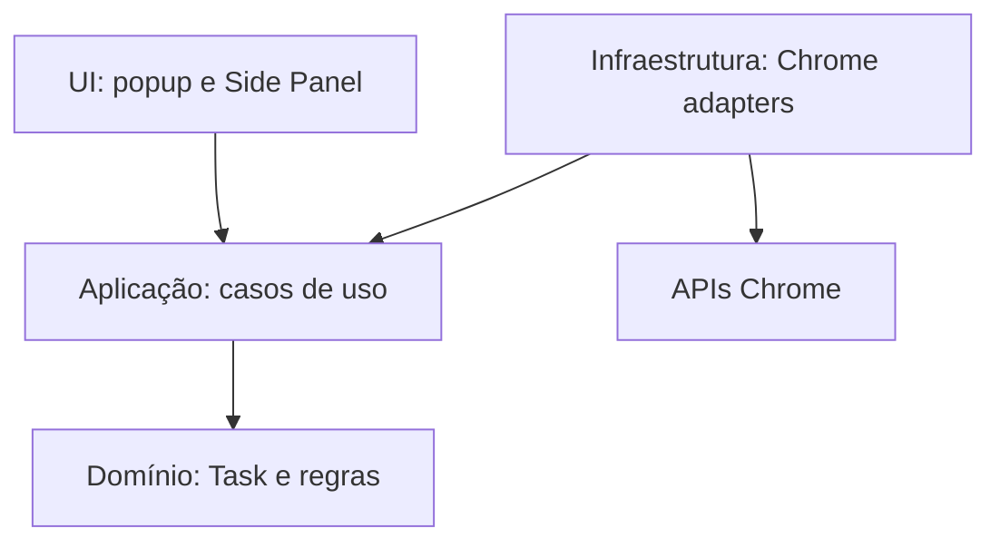

# Arquitetura do TaskFlow

## Contexto

O TaskFlow começa como uma extensão pessoal e local para Chrome. A fundação precisa suportar popup, Side Panel, service worker e persistência local sem antecipar backend, autenticação ou integrações externas.

## Decisões

### WXT em vez de Vite manual

Foi escolhido **WXT 0.21** com Vue 3. O WXT usa Vite internamente e resolve geração do Manifest, entrypoints, modo de desenvolvimento, build e particularidades de extensões. No Vite manual, o projeto precisaria manter plugins/scripts próprios para copiar assets, gerar Manifest V3 e orquestrar popup, Side Panel e service worker.

A decisão reduz código de infraestrutura e continua permitindo acesso à configuração Vite. O custo é adotar convenções de arquivos do WXT e acompanhar sua evolução; esse risco é aceitável para uma extensão com vários entrypoints e futura publicação na Chrome Web Store.

### Popup para captura, Side Panel para gerenciamento

- O popup será otimizado para **Quick Add**, com poucos campos e foco em velocidade.
- O Side Panel será a superfície principal para listagem, busca, filtros e edição completa.

O painel mantém as tarefas visíveis ao lado da página atual e oferece mais área que o popup. Uma página própria poderá ser adicionada por uma Change futura caso surja uma necessidade que o Side Panel não atenda.

### Camadas pequenas e explícitas

- `src/entrypoints`: composição e inicialização das superfícies WXT.
- `src/components`: componentes Vue reutilizáveis.
- `src/application`: casos de uso e portas necessárias por eles.
- `src/domain`: entidades e regras puras, criado quando o MVP for aplicado.
- `src/infrastructure/chrome`: adapters para APIs do navegador.

Não haverá framework de injeção de dependência. As dependências serão montadas por composição simples nos entrypoints.

### Persistência local por repository

Na implementação do MVP, uma interface `TaskRepository` será definida próxima à aplicação/domínio e implementada por um adapter baseado em `chrome.storage.local`/API `browser` exposta pelo WXT. Componentes Vue não conhecerão chaves nem formatos de storage.

O estado persistido terá versão de schema e uma única fronteira de serialização. Isso permite que um repository remoto seja adicionado futuramente sem reescrever regras de negócio. Não serão criados mecanismos de sincronização antes de uma Change específica.

### Comunicação entre contextos

No MVP, popup e Side Panel acessarão os mesmos casos de uso/repository e reagirão às alterações do storage. Mensageria com o background será usada apenas para operações que precisem sobreviver às superfícies de UI ou exijam APIs disponíveis no service worker. Não será criado um barramento genérico antecipadamente.

### Lembretes no Manifest V3

Lembretes serão persistidos junto à tarefa e materializados com `chrome.alarms`. O service worker ouvirá `alarms.onAlarm`, recarregará a tarefa do repository e, se o lembrete ainda for válido, usará `chrome.notifications`.

Essa estratégia não depende de `setTimeout`, estado em memória ou de um service worker permanentemente ativo. Criação, alteração e exclusão de tarefas deverão reconciliar seus alarmes. Reinicialização/atualização da extensão também deverá reconciliar alarmes persistidos.

As permissões `storage`, `alarms` e `notifications` somente serão adicionadas quando esse comportamento entrar na implementação aprovada do MVP.

### Estado com Pinia

Pinia foi escolhido para o estado de apresentação compartilhado por cada superfície Vue: carregamento, filtros, seleção e coordenação das ações assíncronas. O repository continuará sendo a fonte persistente; Pinia não será camada de domínio nem esconderá acesso direto ao Chrome dentro de stores.

### npm

npm foi escolhido por simplicidade, disponibilidade junto ao Node e ausência de benefício concreto de outro gerenciador neste MVP. O `package-lock.json` é versionado e a CI usa `npm ci`.

## Permissões atuais

| Permissão   | Motivo                                                         |
| ----------- | -------------------------------------------------------------- |
| `sidePanel` | Permitir que o popup abra o painel principal de gerenciamento. |

Não há `host_permissions`. As permissões `storage`, `alarms` e `notifications` estão previstas na primeira Change, mas ainda não são solicitadas porque o comportamento funcional não foi aplicado.

## Evolução futura

Sincronização, backend, autenticação, Jira, GitHub, Outlook, Teams, recorrência, subtarefas, histórico, dashboards, linguagem natural, IA e captura de conteúdo da página exigirão Changes próprias. Permissões como `activeTab`, `contextMenus`, `scripting` ou acesso a hosts só devem entrar junto ao caso de uso que as exija.
