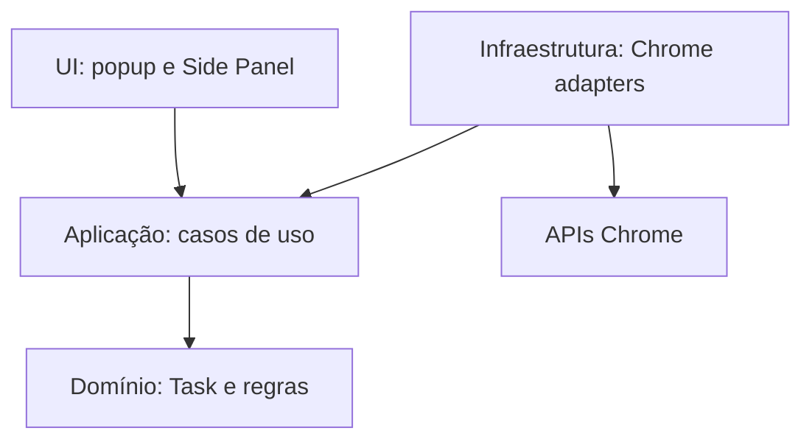

# Arquitetura do TaskFlow

## Contexto

O TaskFlow é uma extensão pessoal, autocontida e local-first para Chrome. O núcleo deve funcionar sem conta, backend próprio, autenticação central ou serviço operado pelo projeto. Popup, Side Panel, service worker e persistência local formam o produto executável.

## Decisões

### Sempre autocontido

O TaskFlow não terá backend próprio ou obrigatório. Dados de tarefas, configurações e regras permanecerão na extensão. Evoluções de persistência devem priorizar mecanismos locais, exportação/importação e adapters substituíveis sem tornar o funcionamento principal dependente de rede.

Integrações externas poderão existir somente como recursos opcionais e explícitos, executados diretamente pela extensão com endpoints, permissões e credenciais controlados pelo usuário. Se uma integração estiver indisponível, o gerenciamento local de tarefas continuará funcionando.

Isso também se aplica à IA: uma evolução futura poderá aceitar chave, endpoint e modelo informados pelo usuário para provedores compatíveis com OpenAI ou Anthropic. A chave deverá permanecer local, nunca aparecer em logs ou exportações, e dados só poderão ser enviados após ação e consentimento claros.

### WXT em vez de Vite manual

Foi escolhido **WXT 0.21** com Vue 3. O WXT usa Vite internamente e resolve geração do Manifest, entrypoints, modo de desenvolvimento, build e particularidades de extensões. No Vite manual, o projeto precisaria manter plugins/scripts próprios para copiar assets, gerar Manifest V3 e orquestrar popup, Side Panel e service worker.

A decisão reduz código de infraestrutura e continua permitindo acesso à configuração Vite. O custo é adotar convenções de arquivos do WXT e acompanhar sua evolução; esse risco é aceitável para uma extensão com vários entrypoints e futura publicação na Chrome Web Store.

### Popup para captura, Side Panel para gerenciamento

- O popup é otimizado para **Quick Add**, com poucos campos e foco em velocidade.
- O Side Panel é a superfície principal para listagem, busca, filtros e edição completa.

O painel mantém as tarefas visíveis ao lado da página atual e oferece mais área que o popup. Uma página própria poderá ser adicionada por uma Change futura caso surja uma necessidade que o Side Panel não atenda.

### Camadas pequenas e explícitas

- `src/entrypoints`: inicialização das superfícies WXT (popup, Side Panel e background), mantidas finas.
- `src/components`: componentes Vue do Quick Add, do gerenciamento e do diálogo de confirmação.
- `src/stores`: store Pinia de apresentação, conectada ao ciclo de vida da superfície.
- `src/application`: casos de uso (`TaskService`, `ReminderService`) e portas (`TaskRepository`, `ReminderScheduler`, `ReminderNotifier`).
- `src/domain`: entidade `Task` e regras puras de validação, status, consultas, prazos e lembretes.
- `src/infrastructure/chrome` e `src/infrastructure/storage`: adapters das APIs do navegador e formato persistido.
- `src/composition`: montagem concreta dos casos de uso com os adapters do Chrome.

Não há framework de injeção de dependência. Os entrypoints usam funções de composição simples; popup e Side Panel fornecem o `TaskService` à aplicação Vue com `provide`, e a store o obtém com `inject`. Um teste de arquitetura impede que domínio e aplicação importem Vue, Pinia, WXT, infraestrutura ou APIs do Chrome.

### Persistência local por repository

A interface `TaskRepository` fica na camada de aplicação e é implementada por `ChromeTaskRepository`, baseado em `chrome.storage.local` pela API `browser` do WXT. As tarefas ficam na chave `taskflow.tasks`, em um envelope `{ schemaVersion: 1, tasks }`. Componentes Vue não conhecem chaves nem formatos de storage.

O decoder valida cada tarefa, completa listas ausentes e descarta propriedades desconhecidas. Envelope de versão desconhecida ou registro inválido é rejeitado integralmente e nunca sobrescrito, para evitar perda de dados. Escritas de uma mesma instância são serializadas e sempre releem a coleção antes de gravar. Isso permite trocar o mecanismo local ou adicionar adapters opcionais sem reescrever regras de negócio. Nenhuma evolução poderá tornar um serviço remoto obrigatório para o funcionamento principal.

### Comunicação entre contextos

Popup e Side Panel usam os mesmos casos de uso e repository e reagem a `storage.onChanged`; não compartilham memória nem trocam mensagens. O background não recebe mensagens das superfícies: ele reage a eventos de instalação, inicialização e alarmes. Não há barramento genérico.

### Lembretes no Manifest V3

Cada lembrete (`id`, `offsetMinutes`, `lastTriggeredFor`) é persistido na tarefa e materializado por `ChromeReminderScheduler` como um alarme `taskflow:reminder:<taskId>:<reminderId>`, com criação e remoção idempotentes. O domínio calcula quais alarmes devem existir; o adapter apenas aplica essa lista.

- O `TaskService` reconcilia os alarmes da tarefa ao criar, editar, alterar status ou excluir. Falha de agendamento não desfaz a tarefa salva e é sinalizada à interface como lembrete pendente.
- O background executa a reconciliação global em `runtime.onInstalled` e `runtime.onStartup`, recriando alarmes futuros ausentes, removendo alarmes sem lembrete correspondente e marcando como processadas as ocorrências cujo horário já passou, sem notificação retroativa.
- Em `alarms.onAlarm`, o `ReminderService` recarrega a tarefa e só usa `chrome.notifications` se ela existir, estiver `TODO` ou `IN_PROGRESS`, mantiver o lembrete, corresponder ao horário agendado e a ocorrência ainda não tiver sido processada. Em seguida registra `lastTriggeredFor`. Alarmes obsoletos são removidos.

Essa estratégia não depende de `setTimeout`, estado em memória ou de um service worker permanentemente ativo. As operações do `ReminderService` são serializadas dentro do service worker apenas para evitar processamento paralelo; a fonte de verdade continua sendo o storage. O ícone das notificações fica em `public/reminder-icon.png`.

### Estado com Pinia

Pinia foi escolhido para o estado de apresentação compartilhado por cada superfície Vue: carregamento, filtros, seleção e coordenação das ações assíncronas. O repository é a fonte persistente; Pinia não é camada de domínio nem esconde acesso direto ao Chrome dentro de stores.

### npm

npm foi escolhido por simplicidade, disponibilidade junto ao Node e ausência de benefício concreto de outro gerenciador neste MVP. O `package-lock.json` é versionado e a CI usa `npm ci`.

## Permissões atuais

| Permissão       | Motivo                                                            |
| --------------- | ----------------------------------------------------------------- |
| `sidePanel`     | Permitir que o popup abra o painel principal de gerenciamento.    |
| `storage`       | Persistir tarefas localmente em `chrome.storage.local`.           |
| `alarms`        | Programar lembretes que sobrevivem à suspensão do service worker. |
| `notifications` | Exibir lembretes de tarefas.                                      |

Não há `host_permissions`, `activeTab`, `tabs`, `scripting` nem `contextMenus`. A URL de origem de uma tarefa é digitada manualmente.

## Evolução futura

Backend próprio, autenticação central e dependência obrigatória de nuvem estão fora da direção do produto. Backup/importação local, integrações diretas opcionais, recorrência, subtarefas, histórico, dashboards, linguagem natural, IA configurada pelo usuário e captura de conteúdo da página exigirão Changes próprias. Permissões como `activeTab`, `contextMenus`, `scripting` ou acesso a hosts só devem entrar junto ao caso de uso que as exija.

A ordem, dependências e prompts de entrada dessas evoluções ficam em [`roadmap.md`](roadmap.md). O roadmap não antecipa artefatos OpenSpec.
