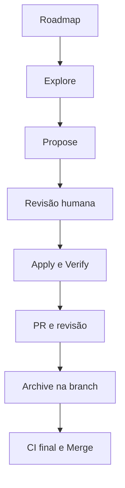

# Roadmap de Changes do TaskFlow

## Objetivo

Este documento é a fonte única para ordem, dependências e prompts iniciais das futuras evoluções do TaskFlow. Ele registra intenção suficiente para preservar continuidade sem criar antecipadamente `proposal.md`, `design.md`, specs delta, tasks ou diretórios em `openspec/changes`.

Cada Change só nasce quando seu item entrar efetivamente em trabalho. Até esse momento, o conteúdo abaixo é backlog orientativo, não especificação aprovada.

## Princípios permanentes

- O TaskFlow é sempre autocontido e local-first.
- O gerenciamento principal funciona sem backend, conta, autenticação central ou rede.
- O projeto não opera backend próprio ou obrigatório.
- Integrações externas são opcionais, diretas da extensão e controladas pelo usuário.
- Credenciais permanecem locais, nunca são registradas em logs nem incluídas em exportações.
- Permissões Chrome são adicionadas somente junto ao comportamento que as exige.
- Uma Change não implementa silenciosamente itens de outra Change.
- Nenhum artefato OpenSpec futuro é criado antes do início real do item.

## Squad híbrida



### Responsabilidades

| Papel                | Responsabilidade                                                                  |
| -------------------- | --------------------------------------------------------------------------------- |
| Roadmap              | Preservar ordem, dependências, resultado desejado e prompt de entrada.            |
| Agente explorador    | Investigar alternativas, riscos, permissões, segurança e dúvidas relevantes.      |
| Agente especificador | Gerar proposal, design, specs e tasks sem iniciar implementação.                  |
| Responsável humano   | Aprovar escopo, UX, permissões, riscos, exceções e decisões difíceis de reverter. |
| Agente implementador | Executar somente os artefatos aprovados e manter evidências de validação.         |
| Agente revisor       | Comparar código, testes, specs, design e critérios de aceitação.                  |
| CI                   | Bloquear integração quando lint, typecheck, testes ou build falharem.             |

### Fluxo de uma Change

1. Selecionar o próximo item elegível no roadmap.
2. Executar `explore` quando houver decisões materiais, riscos ou escopo ainda aberto.
3. Executar `propose` quando o resultado esperado estiver suficientemente claro.
4. Revisar e aprovar os artefatos antes do `apply`.
5. Criar uma feature branch e executar `apply` com commits intermediários coerentes.
6. Executar `verify`, gates automatizados e validação manual aplicável.
7. Abrir PR e realizar revisão contra os artefatos OpenSpec.
8. Depois da aprovação da implementação, executar `archive` na mesma feature branch.
9. Commitar e enviar os artefatos arquivados e specs consolidadas no mesmo PR.
10. Aguardar CI final e fazer merge. Nunca arquivar diretamente na `main`.

## Estados

| Estado              | Significado                                                    |
| ------------------- | -------------------------------------------------------------- |
| `IDEA`              | Resultado ainda preliminar.                                    |
| `READY_FOR_EXPLORE` | Há valor identificado, mas decisões precisam ser investigadas. |
| `EXPLORING`         | Exploração em andamento.                                       |
| `READY_FOR_PROPOSE` | Escopo claro o suficiente para gerar artefatos.                |
| `PROPOSED`          | Artefatos gerados e aguardando revisão.                        |
| `APPROVED`          | Artefatos aprovados para apply.                                |
| `APPLYING`          | Implementação em andamento.                                    |
| `VERIFYING`         | Implementação concluída e sob validação/revisão.               |
| `DONE`              | Change arquivada e integrada à `main`.                         |

## Sequência planejada

| Ordem | Change sugerida                          | Estado              | Dependências                               | Entrada recomendada             |
| ----: | ---------------------------------------- | ------------------- | ------------------------------------------ | ------------------------------- |
|     1 | `criar-mvp-gerenciamento-tarefas`        | `APPROVED`          | Fundação técnica                           | `apply`                         |
|     2 | `adicionar-backup-importacao-exportacao` | `READY_FOR_EXPLORE` | MVP                                        | `explore`                       |
|     3 | `refinar-experiencia-e-acessibilidade`   | `IDEA`              | Uso real do MVP                            | `explore` baseado em evidências |
|     4 | `capturar-pagina-como-tarefa`            | `READY_FOR_EXPLORE` | MVP                                        | `explore`                       |
|     5 | `adicionar-lembretes-personalizados`     | `READY_FOR_EXPLORE` | Lembretes do MVP                           | `explore`                       |
|     6 | `adicionar-tarefas-recorrentes`          | `READY_FOR_EXPLORE` | Lembretes personalizados                   | `explore`                       |
|     7 | `adicionar-subtarefas`                   | `READY_FOR_EXPLORE` | MVP estabilizado                           | `explore`                       |
|     8 | `adicionar-historico-e-desfazer`         | `READY_FOR_EXPLORE` | Modelo de tarefas estabilizado             | `explore`                       |
|     9 | `adicionar-dashboard-local`              | `IDEA`              | Volume real de dados                       | `explore`                       |
|    10 | `configurar-provedores-ia-locais`        | `READY_FOR_EXPLORE` | Backup seguro e política de credenciais    | `explore` de segurança          |
|    11 | `adicionar-assistencia-ia-em-tarefas`    | `IDEA`              | Provedores de IA locais                    | `explore`                       |
|    12 | `preparar-publicacao-chrome-web-store`   | `IDEA`              | MVP estabilizado e política de privacidade | `explore`                       |

## Prompts de entrada

Os prompts abaixo iniciam investigação ou planejamento. Eles não autorizam implementação, criação de PR, archive ou merge.

### 2. Backup, exportação e importação

```text
/opsx:explore Avalie a próxima evolução do TaskFlow para backup, exportação e importação totalmente locais. Considere formato versionado, validação, conflitos, restauração segura, portabilidade, exclusão de credenciais e compatibilidade com futuras versões do schema. O TaskFlow deve continuar autocontido e sem backend. Não implemente. Ao final, recomende o escopo mínimo e, se estiver suficientemente claro, um prompt para /opsx:propose.
```

### 3. Experiência e acessibilidade

```text
/opsx:explore Analise evidências de uso, feedback, problemas visuais e acessibilidade do MVP do TaskFlow. Não suponha problemas sem evidência. Identifique melhorias pequenas e testáveis para popup e Side Panel, separando correções necessárias de preferências estéticas. Não implemente. Recomende se existe escopo suficiente para uma Change.
```

### 4. Captura da página atual

```text
/opsx:explore Avalie como adicionar uma página atual como tarefa no TaskFlow e, opcionalmente, criar tarefa a partir de texto selecionado pelo menu de contexto. Compare activeTab, contextMenus, scripting e content scripts, buscando permissões mínimas e nenhum acesso permanente a todos os sites. Considere título, URL, texto selecionado e favicon. Não implemente. Produza recomendação de escopo e prompt para /opsx:propose.
```

### 5. Lembretes personalizados

```text
/opsx:explore Avalie a evolução dos lembretes do TaskFlow para múltiplos offsets e horários personalizados, preservando confiabilidade com Manifest V3, chrome.alarms, reconciliação idempotente, fuso horário e ausência de notificações duplicadas ou tardias. Não implemente. Recomende o menor modelo evolutivo compatível com os dados existentes.
```

### 6. Tarefas recorrentes

```text
/opsx:explore Avalie tarefas recorrentes totalmente locais no TaskFlow. Considere regras diárias, semanais e mensais, geração da próxima ocorrência, edição apenas desta ocorrência ou da série, fusos, atrasos e integração com lembretes. Evite um motor de calendário excessivamente complexo. Não implemente. Recomende escopo, modelo de domínio e dependências para uma futura proposta.
```

### 7. Subtarefas

```text
/opsx:explore Avalie a introdução de subtarefas no TaskFlow mantendo o modelo simples. Analise profundidade máxima, conclusão da tarefa principal, ordenação, progresso, edição e impacto em pesquisa, filtros e persistência. Não implemente. Recomende se o MVP deve aceitar apenas um nível e gere um prompt de proposta quando as decisões estiverem claras.
```

### 8. Histórico e desfazer

```text
/opsx:explore Avalie histórico local de alterações e desfazer no TaskFlow sem event sourcing ou arquitetura enterprise. Considere quais ações precisam de histórico, retenção, impacto no armazenamento, restauração após exclusão e privacidade. Não implemente. Recomende uma solução proporcional ao uso pessoal.
```

### 9. Dashboard local

```text
/opsx:explore Avalie se os dados reais do TaskFlow justificam um dashboard local. Identifique métricas úteis, período, agrupamentos e visualizações sem criar métricas artificiais. Mantenha todo processamento no navegador. Não implemente e não proponha a Change se ainda não houver volume ou necessidade demonstrável.
```

### 10. Provedores de IA configurados pelo usuário

```text
/opsx:explore Avalie uma configuração BYOK de IA no TaskFlow para OpenAI, APIs compatíveis com OpenAI e Anthropic. O TaskFlow deve continuar funcionando integralmente sem IA e sem backend próprio. Analise armazenamento local de chaves, exclusão de credenciais de logs e backups, optional_host_permissions, endpoints configuráveis, teste de conexão, CORS, consentimento antes do envio de dados, adapters de provider e limites de dependências. Não implemente. Priorize segurança e produza um prompt de /opsx:propose somente se os riscos estiverem resolvidos.
```

### 11. Assistência de IA em tarefas

```text
/opsx:explore Com base na infraestrutura BYOK já implementada, avalie recursos opcionais de IA para resumo, melhoria de escrita, geração de descrição, decomposição de tarefa e interpretação de linguagem natural. Compare valor, custo, privacidade e confirmação humana. Não reimplemente configuração de providers e não torne IA necessária para fluxos normais. Não implemente. Recomende uma primeira capability pequena e mensurável.
```

### 12. Publicação na Chrome Web Store

```text
/opsx:explore Avalie a preparação do TaskFlow para publicação na Chrome Web Store após estabilização do MVP. Considere ícones, descrição, screenshots, política de privacidade, justificativa de permissões, empacotamento, versionamento, checklist manual e automação segura de release. Não publique nem implemente. Recomende a Change mínima e os pré-requisitos ainda ausentes.
```

## Regra de manutenção

Depois de cada merge e archive, atualizar somente o estado, as dependências e o próximo prompt relevante. Novas ideias entram como `IDEA`; não recebem artefatos OpenSpec até serem selecionadas para trabalho.
