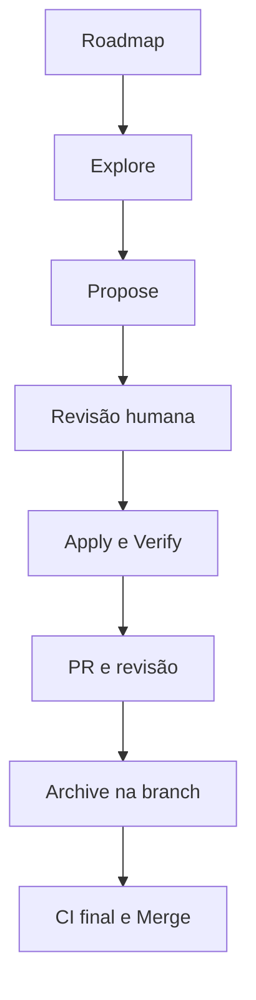

# Roadmap de Changes do TaskFlow

## Objetivo

Este documento é a fonte única para ordem, dependências e prompts iniciais das futuras evoluções do TaskFlow. Ele registra intenção suficiente para preservar continuidade sem criar antecipadamente `proposal.md`, `design.md`, specs delta, tasks ou diretórios em `openspec/changes`.

Cada Change só nasce quando seu item entrar efetivamente em trabalho. Até esse momento, o conteúdo abaixo é backlog orientativo, não especificação aprovada.

## Identificação e datas

- Cada item principal recebe um identificador sequencial e imutável no formato `TF-NNN`.
- Uma Change inserida diretamente após outra pode usar `TF-NNN.M`, com sufixo inteiro crescente, quando estiver relacionada ao item pai e renumerar as entradas posteriores prejudicaria a rastreabilidade.
- O identificador pertence ao roadmap; o slug OpenSpec permanece descritivo e não precisa ser renomeado.
- Novos itens principais usam sempre o próximo `TF-NNN` livre; filhos usam o próximo sufixo livre do pai. Identificadores removidos não são reutilizados.
- `Data de início` é preenchida em `YYYY-MM-DD` quando o `propose` começa e os primeiros artefatos passam a ser criados.
- `Data de conclusão` é preenchida em `YYYY-MM-DD` no commit final do archive, na feature branch.
- A marcação `DONE` e a data de conclusão só são oficiais depois que esse commit entra na `main` pelo merge do PR.

`TF-001`, `TF-002`, `TF-002.1` e `TF-003` estão concluídas. A próxima Change elegível é `TF-004`.

## Princípios permanentes

- O TaskFlow é sempre autocontido e local-first.
- O gerenciamento principal funciona sem backend, conta, autenticação central ou rede.
- O projeto não opera backend próprio ou obrigatório.
- Integrações externas são opcionais, diretas da extensão e controladas pelo usuário.
- Credenciais permanecem locais, nunca são registradas em logs nem incluídas em exportações.
- Permissões Chrome são adicionadas somente junto ao comportamento que as exige.
- Uma Change não implementa silenciosamente itens de outra Change.
- Nenhum artefato OpenSpec futuro é criado antes do início real do item.

## Squad híbrida



### Responsabilidades

| Papel                | Responsabilidade                                                                  |
| -------------------- | --------------------------------------------------------------------------------- |
| Roadmap              | Preservar ordem, dependências, resultado desejado e prompt de entrada.            |
| Agente explorador    | Investigar alternativas, riscos, permissões, segurança e dúvidas relevantes.      |
| Agente especificador | Gerar proposal, design, specs e tasks sem iniciar implementação.                  |
| Responsável humano   | Aprovar escopo, UX, permissões, riscos, exceções e decisões difíceis de reverter. |
| Agente implementador | Executar somente os artefatos aprovados e manter evidências de validação.         |
| Agente revisor       | Comparar código, testes, specs, design e critérios de aceitação.                  |
| CI                   | Bloquear integração quando lint, typecheck, testes ou build falharem.             |

### Fluxo de uma Change

1. Selecionar o próximo item elegível no roadmap.
2. Executar `explore` quando houver decisões materiais, riscos ou escopo ainda aberto.
3. Executar `propose` quando o resultado esperado estiver suficientemente claro.
4. Antes de criar o primeiro artefato do `propose`, marcar a entrada como `IN_PROGRESS`/`PROPOSE` e preencher a data de início.
5. Após gerar os artefatos, marcar `IN_REVIEW`/`REVIEW`; depois da aprovação humana, marcar `APPROVED`/`READY_FOR_APPLY`.
6. Criar uma feature branch e executar `apply`, marcando `IN_PROGRESS`/`APPLY` e fazendo commits intermediários coerentes.
7. Executar `verify`, gates automatizados e validação manual aplicável, mantendo `IN_PROGRESS`/`VERIFY`.
8. Abrir PR e realizar revisão contra os artefatos OpenSpec.
9. Depois da aprovação da implementação, marcar `IN_PROGRESS`/`ARCHIVE` e executar `archive` na mesma feature branch.
10. No commit do archive, marcar `DONE`/`ARCHIVED`, preencher a data de conclusão e incluir os artefatos arquivados e specs consolidadas.
11. Aguardar CI final e fazer merge. A conclusão se torna oficial quando esse commit entra na `main`; nunca arquivar diretamente nela.

## Estados

| Estado              | Significado                                                              |
| ------------------- | ------------------------------------------------------------------------ |
| `IDEA`              | Resultado ainda preliminar.                                              |
| `READY_FOR_EXPLORE` | Há valor identificado, mas decisões precisam ser investigadas.           |
| `EXPLORING`         | Exploração em andamento; ainda não inicia oficialmente a Change.         |
| `READY_FOR_PROPOSE` | Escopo claro o suficiente para gerar artefatos.                          |
| `IN_PROGRESS`       | Artefatos, implementação, verificação ou archive estão sendo executados. |
| `IN_REVIEW`         | Artefatos do propose ou implementação aguardam revisão humana/agêntica.  |
| `APPROVED`          | Artefatos aprovados e aguardando início do apply.                        |
| `DONE`              | Change arquivada, roadmap atualizado e commit integrado à `main`.        |

### Etapas para itens em execução

| Etapa             | Uso                                              |
| ----------------- | ------------------------------------------------ |
| `PROPOSE`         | Artefatos OpenSpec sendo criados ou atualizados. |
| `REVIEW`          | Artefatos ou implementação sob revisão.          |
| `READY_FOR_APPLY` | Artefatos aprovados; apply ainda não iniciado.   |
| `APPLY`           | Implementação das tasks.                         |
| `VERIFY`          | Gates, testes e validação manual.                |
| `ARCHIVE`         | Archive sendo preparado na feature branch.       |
| `ARCHIVED`        | Archive e roadmap prontos e integrados à `main`. |

## Sequência planejada

| ID       | Change sugerida                          | Estado              | Etapa    | Data de início | Data de conclusão | Dependências                                    | Próxima ação                    |
| -------- | ---------------------------------------- | ------------------- | -------- | -------------- | ----------------- | ----------------------------------------------- | ------------------------------- |
| `TF-001` | `criar-mvp-gerenciamento-tarefas`        | `DONE`              | `ARCHIVED` | `2026-09-13`   | `2026-09-13`      | Fundação técnica                                | Concluída                       |
| `TF-002` | `adicionar-backup-importacao-exportacao` | `DONE`              | `ARCHIVED` | `2026-09-13`   | `2026-09-13`      | `TF-001`                                        | Concluída                       |
| `TF-002.1` | `definir-identidade-visual-e-icones`   | `DONE`              | `ARCHIVED` | `2026-09-13`  | `2026-09-13`      | `TF-002`                                        | Concluída                       |
| `TF-003` | `corrigir-acessibilidade-foco-e-contraste` | `DONE`              | `ARCHIVED` | `2026-09-14`   | `2026-09-14`      | `TF-002.1`                                      | Concluída                       |
| `TF-004` | `capturar-pagina-como-tarefa`            | `READY_FOR_EXPLORE` | —        | —              | —                 | `TF-001`                                        | `explore`                       |
| `TF-005` | `adicionar-lembretes-personalizados`     | `READY_FOR_EXPLORE` | —        | —              | —                 | Lembretes de `TF-001`                           | `explore`                       |
| `TF-006` | `adicionar-tarefas-recorrentes`          | `READY_FOR_EXPLORE` | —        | —              | —                 | `TF-005`                                        | `explore`                       |
| `TF-007` | `adicionar-subtarefas`                   | `READY_FOR_EXPLORE` | —        | —              | —                 | `TF-001` estabilizada                           | `explore`                       |
| `TF-008` | `adicionar-historico-e-desfazer`         | `READY_FOR_EXPLORE` | —        | —              | —                 | Modelo de `TF-001` estabilizado                 | `explore`                       |
| `TF-009` | `adicionar-dashboard-local`              | `IDEA`              | —        | —              | —                 | Volume real de dados                            | `explore`                       |
| `TF-010` | `configurar-provedores-ia-locais`        | `READY_FOR_EXPLORE` | —        | —              | —                 | `TF-002` e política de credenciais              | `explore` de segurança          |
| `TF-011` | `adicionar-assistencia-ia-em-tarefas`    | `IDEA`              | —        | —              | —                 | `TF-010`                                        | `explore`                       |
| `TF-012` | `preparar-publicacao-chrome-web-store`   | `IDEA`              | —        | —              | —                 | `TF-002.1` e política de privacidade            | `explore`                       |
| `TF-013` | `refinar-experiencia-com-base-em-uso`    | `IDEA`              | —        | —              | —                 | `TF-003` e uso real de `TF-001`                 | `explore` baseado em evidências |

## Prompts de entrada

Os prompts abaixo iniciam investigação ou planejamento. Eles não autorizam implementação, criação de PR, archive ou merge.

### TF-002 — Backup, exportação e importação

```text
/opsx:explore Avalie a próxima evolução do TaskFlow para backup, exportação e importação totalmente locais. Considere formato versionado, validação, conflitos, restauração segura, portabilidade, exclusão de credenciais e compatibilidade com futuras versões do schema. O TaskFlow deve continuar autocontido e sem backend. Não implemente. Ao final, recomende o escopo mínimo e, se estiver suficientemente claro, um prompt para /opsx:propose.
```

### TF-002.1 — Identidade visual e ícones

**Proposta inicial para investigação:** adotar como direção preferencial um símbolo de check em movimento, com geometria simples, fundo azul-índigo alinhado à interface atual e versão reconhecível em `16×16`. O explore deve comparar essa hipótese com alternativas antes de consolidar a decisão.

```text
/opsx:explore Avalie a identidade visual mínima e o conjunto de ícones do TaskFlow após a TF-002. Parta da interface atual e compare pelo menos três direções: check em movimento, lista com check e monograma TF. Considere diferenciação, legibilidade e reconhecimento em 16×16, 32×32, 48×48 e 128×128; arquivo mestre vetorial; exportações PNG exigidas pelo Chrome; usos no Manifest, barra da extensão, Side Panel e notificações; contraste, versões monocromática e para fundos claros/escuros; consistência com o azul-índigo atual e manutenção simples. Evite símbolos que reduzam o produto a calendário ou lembretes e evite referências visuais a IA, pois ela será opcional. Não redesenhe toda a interface, não implemente e não crie artefatos OpenSpec. Ao final, recomende uma direção visual justificada, os assets mínimos e um prompt pronto para /opsx:propose.
```

### TF-003 — Correções de acessibilidade de foco e contraste

O explore original de experiência e acessibilidade (2026-09-14) não encontrou evidência de uso real nem feedback, mas confirmou por medição e reprodução defeitos de foco, operação por teclado e contraste no popup e no Side Panel. A TF-003 foi restrita a essas correções; melhorias de experiência baseadas em uso foram separadas na `TF-013`.

### TF-013 — Experiência baseada em uso

```text
/opsx:explore Após a TF-003, analise evidências de uso real e feedback do TaskFlow para melhorar a experiência do popup e do Side Panel. Não suponha problemas sem evidência e não repita as correções de acessibilidade da TF-003. Considere, se houver evidência, densidade dos cartões, status repetido no cartão, persistência das mensagens de feedback e destino do foco após salvar uma edição. Separe correções necessárias de preferências estéticas. Não implemente. Recomende se existe escopo suficiente para uma Change.
```

### TF-004 — Captura da página atual

```text
/opsx:explore Avalie como adicionar uma página atual como tarefa no TaskFlow e, opcionalmente, criar tarefa a partir de texto selecionado pelo menu de contexto. Compare activeTab, contextMenus, scripting e content scripts, buscando permissões mínimas e nenhum acesso permanente a todos os sites. Considere título, URL, texto selecionado e favicon. Não implemente. Produza recomendação de escopo e prompt para /opsx:propose.
```

### TF-005 — Lembretes personalizados

```text
/opsx:explore Avalie a evolução dos lembretes do TaskFlow para múltiplos offsets e horários personalizados, preservando confiabilidade com Manifest V3, chrome.alarms, reconciliação idempotente, fuso horário e ausência de notificações duplicadas ou tardias. Não implemente. Recomende o menor modelo evolutivo compatível com os dados existentes.
```

### TF-006 — Tarefas recorrentes

```text
/opsx:explore Avalie tarefas recorrentes totalmente locais no TaskFlow. Considere regras diárias, semanais e mensais, geração da próxima ocorrência, edição apenas desta ocorrência ou da série, fusos, atrasos e integração com lembretes. Evite um motor de calendário excessivamente complexo. Não implemente. Recomende escopo, modelo de domínio e dependências para uma futura proposta.
```

### TF-007 — Subtarefas

```text
/opsx:explore Avalie a introdução de subtarefas no TaskFlow mantendo o modelo simples. Analise profundidade máxima, conclusão da tarefa principal, ordenação, progresso, edição e impacto em pesquisa, filtros e persistência. Não implemente. Recomende se o MVP deve aceitar apenas um nível e gere um prompt de proposta quando as decisões estiverem claras.
```

### TF-008 — Histórico e desfazer

```text
/opsx:explore Avalie histórico local de alterações e desfazer no TaskFlow sem event sourcing ou arquitetura enterprise. Considere quais ações precisam de histórico, retenção, impacto no armazenamento, restauração após exclusão e privacidade. Não implemente. Recomende uma solução proporcional ao uso pessoal.
```

### TF-009 — Dashboard local

```text
/opsx:explore Avalie se os dados reais do TaskFlow justificam um dashboard local. Identifique métricas úteis, período, agrupamentos e visualizações sem criar métricas artificiais. Mantenha todo processamento no navegador. Não implemente e não proponha a Change se ainda não houver volume ou necessidade demonstrável.
```

### TF-010 — Provedores de IA configurados pelo usuário

```text
/opsx:explore Avalie uma configuração BYOK de IA no TaskFlow para OpenAI, APIs compatíveis com OpenAI e Anthropic. O TaskFlow deve continuar funcionando integralmente sem IA e sem backend próprio. Analise armazenamento local de chaves, exclusão de credenciais de logs e backups, optional_host_permissions, endpoints configuráveis, teste de conexão, CORS, consentimento antes do envio de dados, adapters de provider e limites de dependências. Não implemente. Priorize segurança e produza um prompt de /opsx:propose somente se os riscos estiverem resolvidos.
```

### TF-011 — Assistência de IA em tarefas

```text
/opsx:explore Com base na infraestrutura BYOK já implementada, avalie recursos opcionais de IA para resumo, melhoria de escrita, geração de descrição, decomposição de tarefa e interpretação de linguagem natural. Compare valor, custo, privacidade e confirmação humana. Não reimplemente configuração de providers e não torne IA necessária para fluxos normais. Não implemente. Recomende uma primeira capability pequena e mensurável.
```

### TF-012 — Publicação na Chrome Web Store

```text
/opsx:explore Avalie a preparação do TaskFlow para publicação na Chrome Web Store após estabilização do MVP. Considere ícones, descrição, screenshots, política de privacidade, justificativa de permissões, empacotamento, versionamento, checklist manual e automação segura de release. Não publique nem implemente. Recomende a Change mínima e os pré-requisitos ainda ausentes.
```

## Regra de manutenção

Ao iniciar o `propose`, atualizar status, etapa e data de início antes do primeiro artefato. No commit final do archive, atualizar status para `DONE`, etapa para `ARCHIVED` e data de conclusão. Essa conclusão só é oficial quando o commit entra na `main`.

Depois de cada merge, revisar a linha concluída, as dependências desbloqueadas e a indicação da próxima Change. Novas ideias principais recebem o próximo `TF-NNN`; inserções diretamente relacionadas podem receber o próximo `TF-NNN.M` do pai. Elas entram como `IDEA` e não ganham artefatos OpenSpec até serem selecionadas para trabalho.
